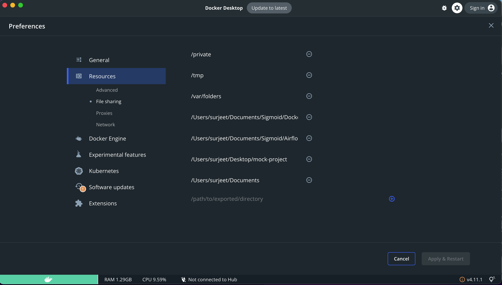

# Cloudera-setup-on-docker

1. Install and run docker desktop [Link](https://www.docker.com/products/docker-desktop/)
2. Clone this repo
3. Go to docker desktop settings -> resources -> file sharing. Then share the cloned repo directory.

   

4. Open terminal in repo root directory
5. Run the following command and wait until process finishes. To check the process status, see in docker logs.

```
docker-compose up -d
```

6. Access cloudera Image

```
docker exec -it cloudera sh
```

7. To access hive: type "hive" in terminal

8. For accessing NameNode and DataNode

NameNode: http://localhost:50070

DataNode: http://localhost:50075
